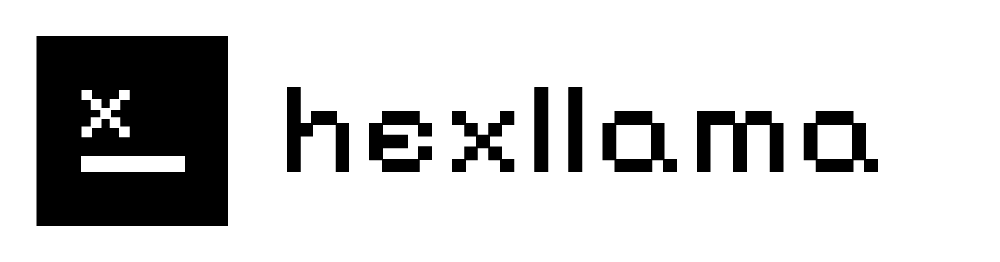
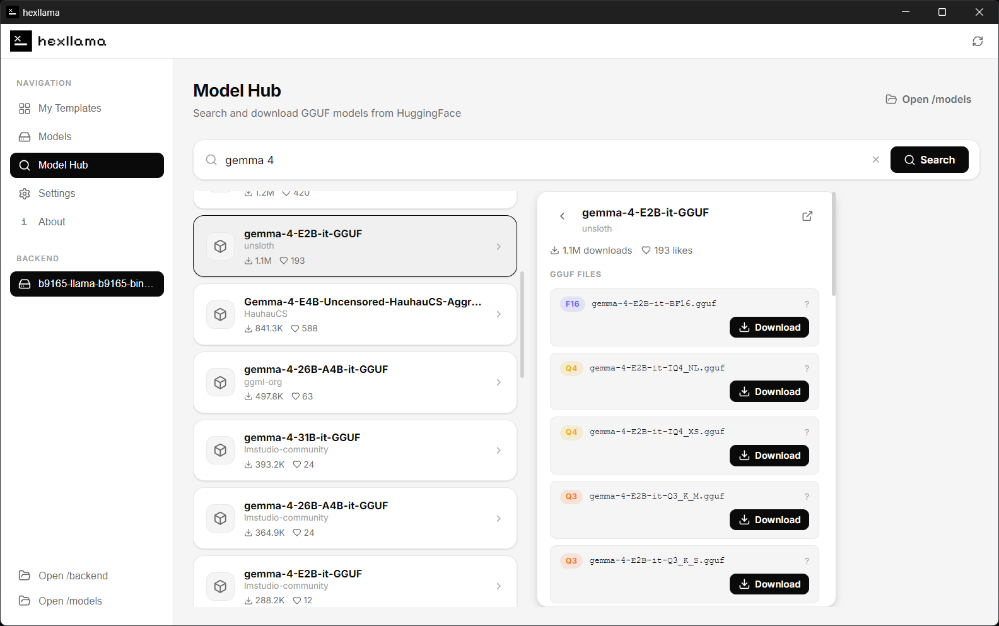
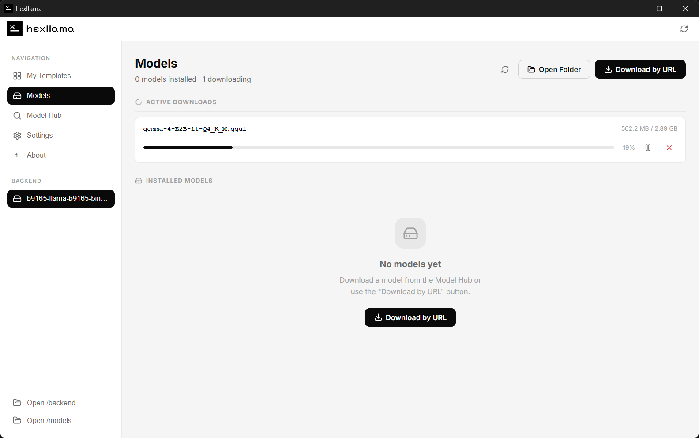
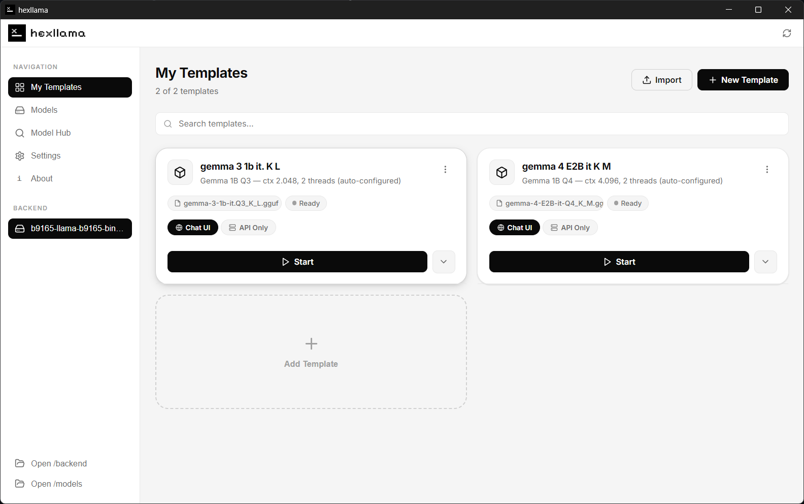
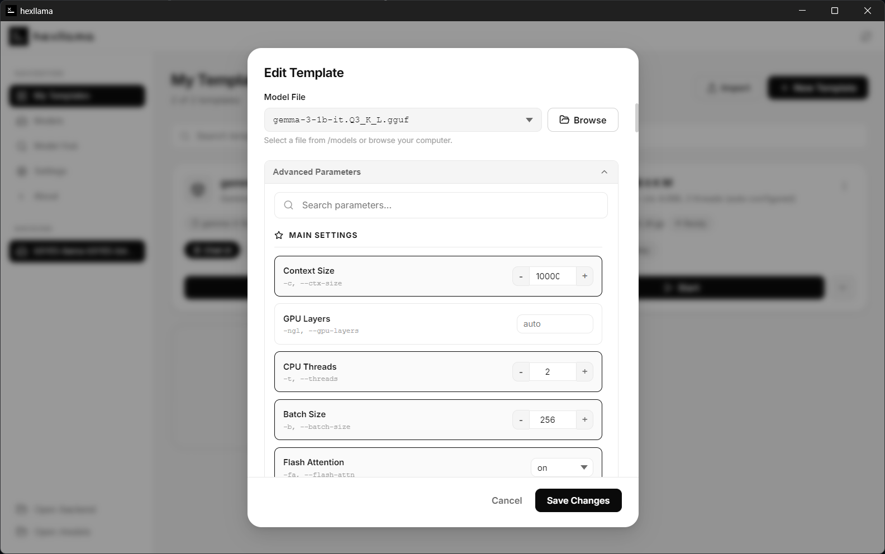
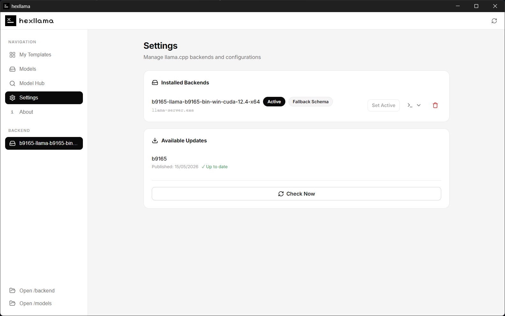

<!-- @format -->

<div align="center">
  
</div>

<p align="center">
  
  
  
  
  
</p>

<br/>

Hexllama is a fast, native desktop interface designed to streamline managing and running local Large Language Models using llama.cpp. It strips away the friction of command-line execution and manual file management, providing a unified workspace to discover, download, configure, and serve models.

Built by and for local AI enthusiasts, Hexllama ensures you spend less time wrestling with terminal arguments and more time interacting with models.

## Features

**Integrated Model Hub**
Search Hugging Face directly within the application. Browse repositories, view file details, and download GGUF models with a single click without ever opening a browser.



**Smart Download Manager**
Pause, resume, or cancel large model downloads reliably. You can also paste direct GGUF links. When a download completes, Hexllama automatically generates an execution template with recommended threads, batch sizes, and context windows tailored to the model's parameters and quantization level.



**Template-Based Execution**
Save your configurations as reusable templates. Run multiple models simultaneously on different ports without conflict. Launch them in "Chat UI" mode to automatically open the built-in llama.cpp web interface, or "API Only" mode to serve them silently in the background.





**Version and Backend Management**
Running cutting-edge models sometimes requires different builds of llama.cpp. Hexllama lets you maintain and seamlessly switch between multiple backend binaries. It automatically checks the ggml-org repository for new releases and lets you download and extract them straight from the settings panel.

**Visual Command Editor**
Stop memorizing execution flags. Edit backend-specific commands through a structured user interface. Toggle booleans, set limits on numerical inputs, and define default parameter values for the llama.cpp server.



## Installation

### Download the Release

The fastest way to get started is to use the pre-compiled installer.

1. Navigate to the [Releases](https://github.com/andersondanieln/hexllama/releases) page.
2. Download the installer for your operating system.
3. Run the installer and launch Hexllama.

### Run Locally

If you want to build from source or modify the project, you can easily run the development environment.

Prerequisites:

- Node.js 18 or higher
- npm

```bash
# Clone the repository
git clone https://github.com/andersondanieln/hexllama.git

# Enter the project directory
cd hexllama

# Install dependencies
npm install

# Start the development server
npm run dev
```

To compile the application into an executable for your current OS:

```bash
npm run build
```

## Acknowledgements

This project exists because of the incredible foundational work of Georgi Gerganov and the ggml-org community. Please consider supporting the development of [llama.cpp](https://github.com/ggerganov/llama.cpp).

## Privacy and Terms

Hexllama is provided as is, without warranty of any kind. The developers assume no liability for damages or issues arising from the use of this software.

This application is strictly local. It does not collect, store, or transmit any telemetry or personal data. Note that downloading models relies on third-party services like Hugging Face, and executing backends relies on the downloaded binaries, both of which are subject to their own respective privacy policies.
