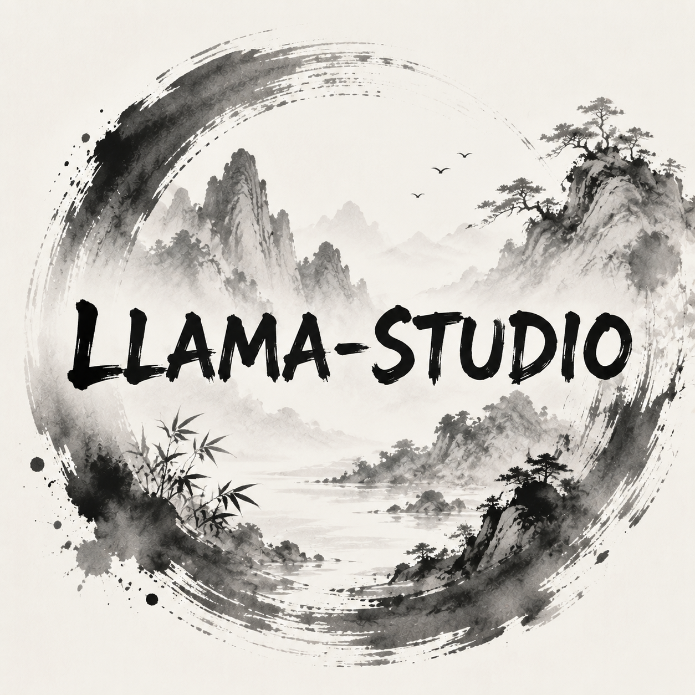

<div align="center">
  
</div>

<p align="center">
  
  
  
  
  
  
  
  
</p>

<p align="center">
  <b>llama-studio</b> — 基于 <a href="https://github.com/ggml-org/llama.cpp">llama.cpp</a> 的本地大模型桌面工作站。
  <br />
  搜索下载模型、模板化多实例运行、内置聊天客户端与 Agent 编码工作台，<b>全程本地完成</b>。
</p>

---

## 📑 目录

- [✨ 核心功能](#核心功能)
- [🛠️ 技术栈](#技术栈)
- [🚀 快速开始](#快速开始)
- [📖 使用指南](#使用指南)
- [⚙️ 配置说明](#配置说明)
- [🔒 隐私声明](#隐私声明)
- [📄 许可证](#许可证)

---

## ✨ 核心功能

> 一套**完全本地运行**的大模型工作台，覆盖从模型获取到智能体自动化的完整链路。

| 分类 | 主要界面 |
| --- | --- |
| 🔍 模型与下载 | 模型中心 · 模型 · 我的模板 · 模型文件夹 |
| 💬 对话与服务 | 聊天 · llama-server · AI 面板 · 知识库 · OCR · 语音合成 · 语音转写 · 图像生成 · 音频工作室 |
| 🧰 分析与工具 | 模型工具 · 模型运行数据 · 性能测试 · Token 统计 · 终端 |
| 🤖 智能体 | Agent Code 工作台 · AI Agent |
| ⚙️ 系统与后端 | 后端与引擎 · 设置 · 关于 |

### 🔍 模型与下载
- **模型中心**：在应用内搜索 Hugging Face / ModelScope，浏览仓库与文件、一键下载 GGUF 模型，无需打开浏览器。
- **模型**：本地模型库管理，查看已下载 GGUF 文件信息，通过 URL 直接下载或分析 HuggingFace 仓库并管理文件。
- **我的模板**：将模型配置保存为可复用模板，多端口同时运行多个模型，支持 **Chat UI** 与 **API Only** 两种启动模式。
- **模型文件夹**：统一管理文本 / 图片 / 语音 / OCR / stable-diffusion.cpp 五类模型文件夹，可增删外部目录。

### 💬 对话与服务
- **聊天**：内置聊天客户端——思考链展示与折叠、LaTeX 公式渲染、代码块实时预览、图片/PDF/Word 附件解析、消息导航、token 速率统计、会话管理与导出。
- **llama-server**：内嵌运行中的 llama.cpp server Web UI，可复制服务地址、在外部浏览器打开、一键停止服务。
- **AI 面板**：JSON 驱动的动态 UI 面板（基于 @json-render），用自然语言 + 模型生成 UI 规范并渲染交互界面。
- **知识库**：本地知识库（RAG），上传/拖入文档向量化入库，供对话时检索增强。
- **OCR**：利用 llama.cpp 从图片中提取文字，全程本地处理。
- **语音合成**：本地 TTS（Qwen3-TTS / OuteTTS），文本离线生成 wav，支持多语言与参考音频克隆音色，可试听/下载。
- **语音转写**：本地 ASR（llama-mtmd），选择音频文件离线转写为文本，兼容 granite-speech / Qwen3-Omni 等。
- **图像生成**：文生图 / 图生图，调用运行中的 stable-diffusion.cpp（sd-server）兼容接口，支持采样器、提示词预设与历史记录。
- **音频工作室**：内嵌运行中的 audio.cpp 服务 Web UI，进行音乐 / 音频生成，可刷新、外部打开、停止服务。

### 🧰 分析与工具
- **模型工具**：GGUF 分析工具集——元数据检查、tokenizer 可视化、显存与上下文层数估算、模型对比、聊天模板调试。
- **模型运行数据**：运行中模型的 CPU、内存等资源占用实时监控。
- **性能测试**：内置 llama-bench 基准测试视图，一键跑分对比模型吞吐。
- **Token 统计**：基于本地使用记录的 Token 用量统计（按模型、按活动时间分布），纯本地、不联网。
- **终端**：集成式多标签终端（xterm.js + node-pty），可指定工作目录、调整字号、多会话并行。

### 🤖 智能体
- **Agent Code 工作台**：本地模型驱动的编码代理，通过 20+ 内置工具（读写/编辑文件、代码搜索、目录分析、后台任务等）自主完成任务；配套文件树、Git diff 审查、变更汇总、内置浏览器、提示词配置、工具调用审计与调试面板。
- **AI Agent**：侧边栏管理与启动基于 npm 的 AI 代理脚本（安装状态检测、版本更新），扩展自动化工作流。

### ⚙️ 系统与后端
- **后端与引擎**：维护与切换多个 llama.cpp 二进制版本，自动检查新版本并在设置中一键下载更新。
- **设置**：全局偏好配置（主题、后端路径、下载目录等）。
- **关于**：版本与许可证信息。

---

## 🛠️ 技术栈

| 层级 | 技术 |
| --- | --- |
| 桌面框架 | [Electron](https://www.electronjs.org/) 43 |
| 包管理器 | [Bun](https://bun.sh/) 1.4 |
| UI 框架 | [React](https://react.dev/) 19 |
| 语言 | [TypeScript](https://www.typescriptlang.org/) 5 |
| 构建工具 | [Vite](https://vitejs.dev/) 5 + [electron-vite](https://electron-vite.org/) |
| 状态管理 | [Zustand](https://github.com/pmndrs/zustand) |
| 终端 | [xterm.js](https://xtermjs.org/) + [node-pty](https://github.com/microsoft/node-pty) |
| Markdown 渲染 | [react-markdown](https://github.com/remarkjs/react-markdown) + [KaTeX](https://katex.org/) |
| 文档解析 | [PDF.js](https://mozilla.github.io/pdf.js/)、[Mammoth.js](https://github.com/mwilliamson/mammoth.js) |
| PDF 导出 | [jsPDF](https://github.com/parallax/jsPDF) + [html2canvas](https://html2canvas.hertzen.com/) |
| 图标 | [Lucide React](https://lucide.dev/) |
| 打包 | [electron-builder](https://www.electron.build/) |

---

## 🚀 快速开始

### 环境要求

- **Bun** ≥ 1.4（依赖安装与脚本运行，推荐）
- **Node.js** ≥ 18（构建及部分原生工具需要）
- **Git**

> 本项目使用 **Bun** 管理依赖，锁文件为 `bun.lock`。若改用 npm 需注意 lockfile 差异。

### 安装与运行

```bash
# 克隆仓库
git clone https://github.com/zwchyt/llama-studio.git
cd llama-studio

# 安装依赖
bun install

# 启动开发模式
bun run dev
```

### 打包发布

```bash
bun run package
```

使用 electron-builder 构建安装包，产物位于 `dist/` 目录。

> **注**：`bun run build` 仅执行过滤构建脚本，不会产出安装包。
>
> **Electron 二进制**：Bun 默认屏蔽 `postinstall` 脚本，可能跳过 Electron 二进制下载，启动时报 `Electron uninstall`。若出现，执行 `node node_modules/electron/install.js` 提取二进制，或运行 `bun pm trust` 允许安装脚本。

---

## 📖 使用指南

### 1. 浏览与下载模型
- 打开 **模型中心** 标签页，搜索 Hugging Face 上的 GGUF 模型。
- 点击模型查看详情，选择量化版本，一键下载。

### 2. 创建执行模板
- 进入 **我的模板**，点击 **新建模板**。
- 选择已下载的模型，配置上下文长度、GPU 层数等 llama.cpp 参数。
- 选择 **Chat UI**（交互对话）或 **API Only**（服务端）启动模式。

### 3. 运行模型
- 在模板上点击 **运行**，后端会在 **终端** 视图中自动启动。
- Chat UI 模式可直接对话；API Only 模式使用提供的端点地址。

### 4. 内置聊天对话
- 模型运行后进入 **聊天** 视图，无需浏览器即可对话。
- 支持拖入图片/PDF/Word 作为附件，思考链、公式与代码块自动渲染。

### 5. 使用 Agent Code 工作台
- 进入 **Agent Code** 视图，选择项目工作区目录并连接运行中的模型。
- 在会话中下达任务，模型会调用工具读写文件完成编码；通过顶栏的 **变更** 审查 Git diff，**审计** / **调试** 面板追踪工具调用。

### 6. 基准测试与监控
- 在 **性能测试** 视图选择模型一键跑分；在 **模型运行数据** 视图查看运行中模型的资源占用。

### 7. 管理后端
- 进入 **设置** → **后端与引擎**，切换或更新 llama.cpp 版本。

### 8. 使用 AI Agent 脚本
- 从侧边栏打开 **AI Agent** 面板，管理基于 npm 的代理脚本。

### 9. OCR 与文档处理
- 在 **OCR** 视图中上传图片，利用正在运行的模型提取文字。

---

## ⚙️ 配置说明

### Electron Builder (`electron-builder.yml`)
配置应用打包参数——应用 ID、安装程序类型、文件关联、签名等。

### 聊天模板 (`chat-templates/`)
将自定义 Jinja2 聊天模板放入此目录，应用会自动加载。

### 执行模板 (`templates/`)
保存模板时自动生成，每个文件是一个以 UUID 命名的 JSON：
```json
{
  "id": "uuid",
  "name": "我的模板",
  "modelPath": "models/qwen2.5-7b-q4_k_m.gguf",
  "ctxSize": 8192,
  "gpuLayers": 33,
  "port": 8080,
  "mode": "chat"
}
```

### 设置文件 (`settings.json`)
自动生成的全局偏好配置（主题、后端路径、下载目录等）。

---

## 🙏 致谢

- **[hexllama](https://github.com/andersondanieln/hexllama)** — 上游 fork 来源及核心框架
- **[llama.cpp](https://github.com/ggml-org/llama.cpp)** — 由 Georgi Gerganov 及 ggml-org 社区维护

---

## 🔒 隐私声明

本应用 **完全本地运行**。不收集、不存储、不传输任何遥测或个人数据。模型下载依赖第三方服务（Hugging Face 和 ModelScope），后端二进制文件遵循各自的许可协议。

---

## 📄 许可证

本项目基于 [hexllama](https://github.com/andersondanieln/hexllama) 衍生。详见 [LICENSE](LICENSE) 文件。

---

<div align="center">
  <sub>为本地 AI 社区而建 ❤️</sub>
</div>
